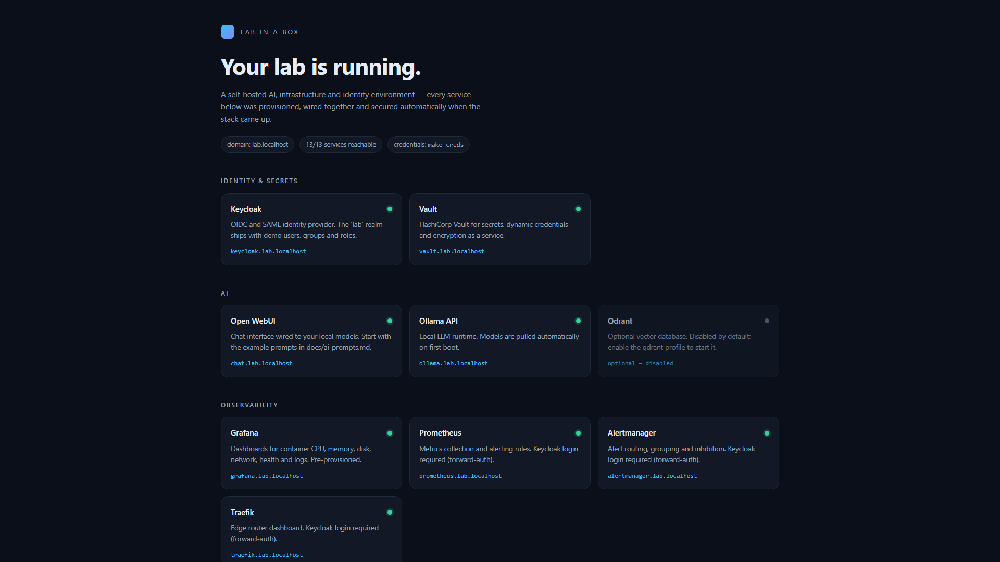
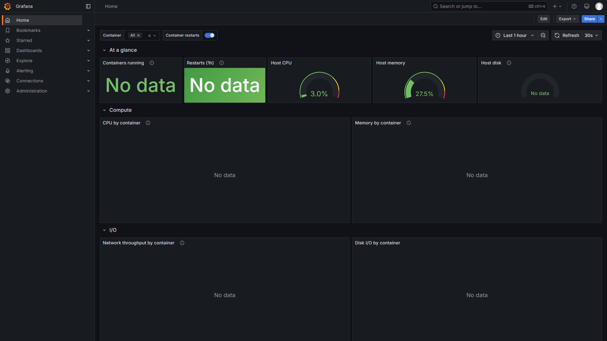
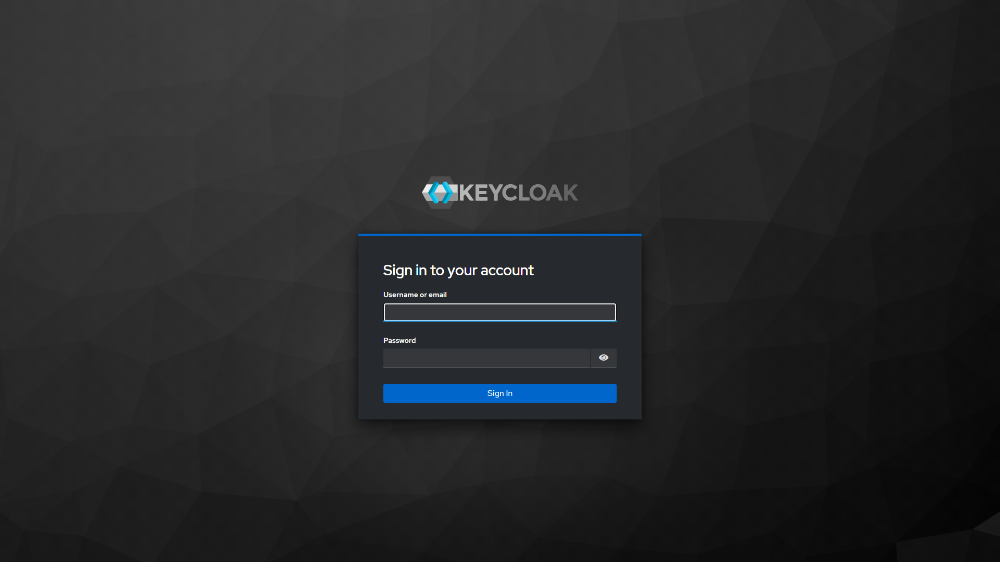
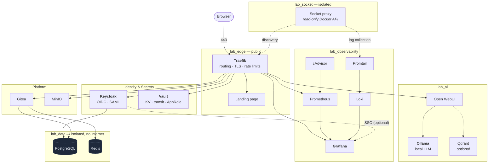

<div align="center">

# Lab-in-a-Box

**A complete self-hosted AI, infrastructure and identity lab. One command. Zero configuration.**

Twenty-five default containers — identity, secrets, observability, object storage, Git hosting and a
local LLM — provisioned, wired together and hardened automatically. Two more services, Qdrant and
Watchtower, are available through optional Compose profiles.

[](LICENSE)
[](https://docs.docker.com/compose/)
[](docs/SERVICES.md)
[](#quick-start)
[](CONTRIBUTING.md)
[](https://github.com/chriswayneh/lab-in-a-box/actions/workflows/ci.yml)
[](https://github.com/chriswayneh/lab-in-a-box/actions/workflows/security.yml)

[Quick start](#quick-start) ·
[Architecture](#architecture) ·
[Services](#services) ·
[Security](#security) ·
[AI](#ai) ·
[Roadmap](#roadmap) ·
[Contributing](CONTRIBUTING.md)

</div>

---

## What this is

Most "homelab" repositories are a `docker-compose.yml` and a list of things you still have to do by hand:
create the database, import the realm, add the datasource, generate a password, connect service A to
service B.

This one does all of that itself.

```bash
git clone https://github.com/chriswayneh/lab-in-a-box.git
cd lab-in-a-box
docker compose up -d
```

A few minutes later you have a running identity provider with a populated realm, a secrets manager with
policies and roles, dashboards already showing live container metrics, an object store with buckets,
a Git server with an administrator, and a local language model you can chat with — all behind a single
reverse proxy on friendly hostnames, with no entry added to your `hosts` file.

It is built to be read as much as run. Every non-obvious decision is explained where it is made, and the
trade-offs that a lab makes against production are stated plainly rather than hidden.

### What you get

| | |
| --- | --- |
| **Identity** | Keycloak with a seeded realm — 4 users, 4 groups, 6 roles, 4 OIDC clients, brute-force protection and a password policy |
| **Identity lifecycle** | Joiner/Mover/Leaver automation across Keycloak, Vault and Gitea — group-based RBAC, access diffing, session and refresh-token revocation, repository custody transfer, redacted audit records |
| **Access review** | A read-only RBAC simulator that answers "what can this person reach, and why?" — resolves live Keycloak, Vault and Gitea state, explains every grant's source, and surfaces entitlement drift |
| **Secrets** | Vault with KV v2, transit encryption, AppRole for machines, userpass for humans, and least-privilege ACL policies |
| **Observability** | Prometheus, Grafana, Loki and Promtail — 3 provisioned dashboards, 9 alert rules, metrics and logs correlated |
| **AI** | Ollama with a model pulled automatically, Open WebUI wired to it, optional Qdrant for retrieval |
| **Platform** | Gitea with Actions enabled, MinIO with buckets, policies, versioning and lifecycle rules |
| **Edge** | Traefik with automatic service discovery, TLS, rate limiting and security headers |
| **Operations** | Portainer, pgAdmin, Adminer, backups, health checks and a Makefile that explains itself |

---

## Screenshots

> Screenshots below were captured from the local development lab. They use only the project's
> local service names and demo interfaces.

<div align="center">

| Landing page | Grafana overview |
| :---: | :---: |
|  |  |
| Every active service, with live reachability | The provisioned Lab Overview dashboard |

| Keycloak realm | Open WebUI |
| :---: | :---: |
|  |  |
| Keycloak administrator sign-in | Open WebUI's local first-run sign-in |

</div>

---

## Quick start

### Requirements

| | Minimum | Comfortable |
| --- | --- | --- |
| Docker Engine | 24.0 | latest |
| Docker Compose | v2.20 (for `include:`) | latest |
| RAM | 8 GB | 16 GB |
| Disk | 20 GB free | 40 GB free |
| CPU | 4 cores | 8 cores |

Optional: GNU `make` and `bash` for the convenience targets. Everything works without them —
the equivalent `docker compose` command is shown alongside each target below.

<details>
<summary><strong>Windows, macOS and Linux notes</strong></summary>

**Windows** — install [Docker Desktop](https://docs.docker.com/desktop/install/windows-install/) with the
WSL 2 backend. Use Git Bash (ships with [Git for Windows](https://git-scm.com/download/win)) or a WSL
shell to run `make`. In plain PowerShell, use the `docker compose` commands directly.

**macOS** — Docker Desktop or [OrbStack](https://orbstack.dev/). Give Docker at least 8 GB of RAM in
Settings → Resources, or Keycloak and Ollama will fight over memory.

**Linux** — Docker Engine plus the Compose plugin. If your user is not in the `docker` group you will
need `sudo` for every command.

</details>

### Run it

**Windows / easiest path.** Open PowerShell and paste these three lines. Docker Desktop must be
running first.

```powershell
git clone https://github.com/chriswayneh/lab-in-a-box.git
cd lab-in-a-box
docker compose up -d
```

This is enough to use the complete local lab. It uses the deliberately published development passwords,
which is appropriate only because the lab is reachable only from this computer.

**Use unique passwords (recommended).** On macOS/Linux, or in Git Bash/WSL on Windows, run:

```bash
make up
```

`make up` generates unique credentials before starting and keeps file-backed ones in the git-ignored
`secrets/local/` directory.

Generate real ones at any time:

```bash
make secrets && make clean && make up
```

<details>
<summary><strong>Why <code>clean</code> is needed after rotating credentials</strong></summary>

Keycloak, Gitea, Grafana and MinIO each store a hash of their administrator password inside their own
volume on first boot. Changing the value in `.env` afterwards changes what the lab *offers*, not what
those services *expect*, so the login silently keeps failing with the old password. Recreating the
volumes is what makes the new credential take effect.

</details>

### Watch it come up

```bash
make logs      # follow everything      →  docker compose logs -f
make health    # container, job and route status
make creds     # every URL and password
```

First boot takes a few minutes: it pulls around 6 GB of images and downloads a language model.
Later starts take seconds.

### Open it

Everything lives on `*.lab.localhost`, which resolves to `127.0.0.1` on every modern operating system
under [RFC 6761](https://www.rfc-editor.org/rfc/rfc6761#section-6.3) — no `hosts` file editing, no DNS setup.

**<https://lab.localhost>** is the front door and links to everything else.

> **Note**
> Your browser will warn about the certificate. That is expected: the lab generates a self-signed one so
> that HTTPS works with zero setup. For Windows, the two-copy-and-paste-step fix is in
> [Trusted local HTTPS](#trusted-local-https-windows) below.

---

## Architecture



### Five networks, not one

Segmentation is the cheapest security control in the whole stack. A service can only reach what it shares
a network with.

| Network | Isolated | What lives there |
| --- | :---: | --- |
| `lab_edge` | | Traefik and everything with an HTTP route |
| `lab_data` | 🔒 | PostgreSQL, Redis and their clients — **no internet access, in or out** |
| `lab_observability` | | Scrape targets, log shippers and their backends |
| `lab_ai` | | Model serving (needs egress to download model weights) |
| `lab_socket` | 🔒 | The read-only Docker API proxy |

A compromised chat interface has no route to the identity provider's database. That is not a policy
statement — there is no network path.

### Startup order

Services declare what they need, and Compose starts them in dependency order, waiting on
*healthchecks* rather than guessing with `sleep`.

```text
socket-proxy ──▶ traefik
postgres ────┬─▶ keycloak ──▶ keycloak-init
             └─▶ gitea ─────▶ gitea-init
redis ───────┘
cadvisor ────▶ prometheus ─┬─▶ grafana
loki ────────▶ promtail    │
             loki ─────────┘
ollama ──────┬─▶ ollama-init
             └─▶ open-webui
minio ───────▶ minio-init
vault ───────▶ vault-init
```

A full generated graph lives in [`architecture/dependency-graph.mmd`](architecture/dependency-graph.mmd),
and a deeper walkthrough — including the ASCII diagram, the request path and the provisioning model — is in
[`docs/architecture.md`](docs/architecture.md).

### One project, six files

A single 1,500-line compose file is unreviewable. This one uses the Compose Spec `include:` directive, so
the stack is one project with one dependency graph, split into fragments you can actually read:

```text
docker-compose.yml            networks, volumes, secrets, includes
├── compose/01-core.yml           Traefik, socket proxy, PostgreSQL, Redis, landing page
├── compose/02-iam.yml            Keycloak, Vault, and their provisioning jobs
├── compose/03-observability.yml  Prometheus, Grafana, Loki, Promtail, cAdvisor, node-exporter
├── compose/04-ai.yml             Ollama, Open WebUI, Qdrant
├── compose/05-platform.yml       Gitea, MinIO, and their provisioning jobs
└── compose/06-tools.yml          Portainer, pgAdmin, Adminer, Watchtower
```

---

## Services

Full generated catalogue, including images, networks and privileges:
**[`docs/SERVICES.md`](docs/SERVICES.md)** (`make docs` regenerates it from the compose project).

| Service | URL | What it is |
| --- | --- | --- |
| **Landing page** | <https://lab.localhost> | Index of every service, with live status |
| **Traefik** | <https://traefik.lab.localhost> | Edge router. Discovers services automatically; terminates TLS |
| **Keycloak** | <https://keycloak.lab.localhost> | Identity provider. OIDC and SAML, with a seeded demo realm |
| **Vault** | <https://vault.lab.localhost> | Secrets management, dynamic credentials, encryption as a service |
| **Grafana** | <https://grafana.lab.localhost> | Dashboards. Datasources and panels provisioned from files |
| **Prometheus** | <https://prometheus.lab.localhost> | Metrics collection and alert rule evaluation |
| **Open WebUI** | <https://chat.lab.localhost> | Chat interface for the local models |
| **Ollama** | <https://ollama.lab.localhost> | Local LLM runtime and API |
| **Gitea** | <https://git.lab.localhost> | Git hosting with issues, pull requests and CI |
| **MinIO** | <https://minio.lab.localhost> | Object storage console (S3 API at `s3.lab.localhost`) |
| **Portainer** | <https://portainer.lab.localhost> | Container management and troubleshooting — `admin` / `portainer-insecure-dev-only` |
| **pgAdmin** | <https://pgadmin.lab.localhost> | PostgreSQL console, pre-connected to all three databases |
| **Adminer** | <https://adminer.lab.localhost> | Lightweight database client |
| **Qdrant** | <https://qdrant.lab.localhost> | Vector database — optional, `COMPOSE_PROFILES=qdrant` |

### Host ports

The lab binds four ports on your machine, and no more. Everything else is reachable only through Traefik.

| Port | Service | Bound to | Why |
| --- | --- | --- | --- |
| `80` | Traefik | all interfaces | HTTP |
| `443` | Traefik | all interfaces | HTTPS |
| `5432` | PostgreSQL | `127.0.0.1` only | Local tools — `psql`, DataGrip, migrations |
| `6379` | Redis | `127.0.0.1` only | Local tools — `redis-cli` |
| `2222` | Gitea SSH | all interfaces | `git clone ssh://` — cannot be routed by an HTTP proxy |

Change any of them in `.env` (`LAB_HTTP_PORT`, `LAB_HTTPS_PORT`, `POSTGRES_PORT`, `REDIS_PORT`,
`GITEA_SSH_PORT`) if something already has them.

### Credentials

```bash
make creds
```

Reads the live values out of `.env` and the selected Docker-secret directory, and flags in red anything
still using a shipped default. Nothing is duplicated into documentation that could drift.

The Keycloak realm is seeded with four demo users that share one password, modelling an access-control
scenario rather than four identical accounts:

| User | Group | Roles | Represents |
| --- | --- | --- | --- |
| `alice` | Platform Engineering | `platform-admin`, `developer`, `ai-user` | Runs the infrastructure |
| `bob` | Application Engineering | `developer`, `ai-user` | Builds on it |
| `carol` | Security | `security-analyst`, `auditor`, `ai-user` | Reviews it |
| `dave` | Contractors | `contractor` | External, deliberately minimal access |

Roles are granted to *groups*, and users join groups — nobody holds a role directly. That indirection is
the whole point of RBAC, and it is what the Joiner/Mover/Leaver demo on the [roadmap](#roadmap) automates.

---

## Commands

`make` on its own prints all of them.

| Command | Does | Without `make` |
| --- | --- | --- |
| `make up` | Start the lab, generating credentials on first run | `docker compose up -d` |
| `make down` | Stop everything, **keep all data** | `docker compose down` |
| `make restart` | Restart all, or one `SERVICE=` | `docker compose restart` |
| `make clean` | Delete every volume — asks first | `docker compose down -v` |
| `make logs` | Follow logs, all or one `SERVICE=` | `docker compose logs -f` |
| `make ps` | Container status | `docker compose ps` |
| `make health` | Containers, provisioning jobs and HTTP routes | `bash scripts/health-check.sh` |
| `make creds` | Print every URL and credential | `bash scripts/show-credentials.sh` |
| `make secrets` | Generate random credentials | `bash scripts/generate-secrets.sh` |
| `make backup` | Snapshot databases and volumes | `bash scripts/backup.sh` |
| `make restore` | Restore a backup, newest by default | `bash scripts/restore.sh` |
| `make update` | Pull newer images and recreate what changed | `docker compose pull && docker compose up -d` |
| `make validate` | Everything CI checks, locally | `bash scripts/validate.sh` |
| `make docs` | Regenerate the catalogue and dependency graph | `bash scripts/generate-docs.sh` |
| `make shell SERVICE=x` | Shell inside a container | `docker compose exec x sh` |
| `make https-on` / `off` | Toggle the HTTP→HTTPS redirect | — |
| `make jml-join` | Provision an identity everywhere | `bash scripts/jml.sh join …` |
| `make jml-move` | Change role profile, with an access diff | `bash scripts/jml.sh move …` |
| `make jml-leave` | Offboard and revoke access everywhere | `bash scripts/jml.sh leave …` |
| `make jml-show` | Print effective access across services | `bash scripts/jml.sh show …` |
| `make jml-test` | Run the identity test suites | `bash scripts/test-identity.sh` |
| `make rbac-show` | Effective access for one identity, with reasons | `bash scripts/rbac.sh show …` |
| `make rbac-diff` | What one identity can reach that another cannot | `bash scripts/rbac.sh diff …` |
| `make rbac-who-can` | Every identity that can reach a resource | `bash scripts/rbac.sh who-can …` |

**Variables:** `GPU=1` (NVIDIA passthrough for Ollama), `PROFILES=qdrant,watchtower`,
`SERVICE=<name>`, `BACKUP=<timestamp>`, `FORCE=1`, `USER=`/`ROLE=`/`FROM=`/`TO=` for the `jml-*` targets.

---

## Identity lifecycle

The realm models RBAC. These commands model what happens to it **over time** —
the part where real identity programmes actually fail.

```bash
make jml-join  USER=erin ROLE=developer     # provision across Keycloak, Vault, Gitea
make jml-move  USER=erin FROM=developer TO=security   # with a before/after access diff
make jml-leave USER=erin                    # revoke everywhere, including live sessions
```

Four role profiles ([`identity/profiles.json`](identity/profiles.json)) map onto the
groups the realm already has. Authorization stays group-based — the engine never
grants a role directly to a user.

| Flow | What it does |
| --- | --- |
| **Joiner** | Creates the Keycloak user and group membership, a Vault `userpass` identity bound to one policy, and a Gitea account and team. Idempotent: a second run reports `UNCHANGED` and never resets a password |
| **Mover** | Removes obsolete access *before* adding new access, so entitlements cannot accumulate, then prints a diff resolved from live API reads |
| **Leaver** | Disables (never deletes) both accounts, revokes sessions and refresh tokens, deletes the Vault identity and revokes its outstanding leases, and **transfers** owned repositories to a custody account rather than orphaning them |

Every run writes a redacted JSON record to `artifacts/identity/<user>/`.

### Access review — what can this person reach?

```bash
make rbac-show    USER=erin                              # effective access, with reasons
make rbac-diff    USER=alice OTHER=bob                   # what one has that the other does not
make rbac-who-can PERMISSION=vault:secret/data/security/*  # reverse lookup
```

Read-only. It resolves live state rather than restating configuration — Vault
policy documents are fetched and parsed into the paths they actually grant,
Grafana's role is computed from the deployment's own `role_attribute_path`, and
every grant says whether it is direct, group-inherited or derived.

It also compares actual access against what the role profile expects and reports
the difference as **drift** — an extra Gitea team, an unexpected Vault policy, an
entitlement that survived an offboarding. Services with no identity integration
are labelled as such rather than silently reported as "no access".

`make jml-test` runs 238 integration checks across both suites against the live
lab — nothing mocked.

On revocation, the docs are explicit about what is and isn't proven: refresh
tokens die immediately and the access token is rejected by anything that consults
Keycloak, but a resource server validating a JWT purely offline would still accept
it until `exp` — bounded to 300 seconds by the realm's `accessTokenLifespan`.

**→ [docs/identity-governance.md](docs/identity-governance.md)** for the full model,
security implications and limitations.

---

## Configuration

Everything lives in one file. Copy the annotated template and edit nothing else:

```bash
cp .env.example .env    # or: make secrets
```

Highlights:

| Variable | Default | Notes |
| --- | --- | --- |
| `LAB_DOMAIN` | `lab.localhost` | Every service is published at `<name>.$LAB_DOMAIN`. Point it at a real domain for a remote deployment — Keycloak's redirect URIs are rewritten to match automatically |
| `LAB_HTTP_PORT` / `LAB_HTTPS_PORT` | `80` / `443` | Change if something already owns them |
| `LAB_FORCE_HTTPS` | `false` | Off so the first run is not a wall of certificate warnings |
| `COMPOSE_PROFILES` | *(empty)* | `qdrant`, `watchtower` |
| `OLLAMA_DEFAULT_MODELS` | `llama3.2:1b` | Comma-separated. Small by default (~1.3 GB) so the lab is usable in minutes |
| `PROMETHEUS_RETENTION_TIME` | `15d` | Also bounded by size, which matters more on a laptop |
| `LOKI_RETENTION_PERIOD` | `168h` | |
| `GRAFANA_OIDC_ENABLED` | `false` | Set `true` to sign in to Grafana through Keycloak |

### GPU

```bash
make up GPU=1
```

Requires an NVIDIA GPU and the
[Container Toolkit](https://docs.nvidia.com/datacenter/cloud-native/container-toolkit/latest/install-guide.html).
Layers [`compose/overrides/gpu.yml`](compose/overrides/gpu.yml), which also raises the model keep-alive —
with a GPU, keeping a model resident is cheap and reloading is the expensive part.

---

## Security

This is a **development lab**, not a production deployment, and it is explicit about the difference.
[`docs/security.md`](docs/security.md) is the full threat model. The short version:

### What it does properly

- **Network segmentation** — five networks; the database and Docker API planes are `internal: true`
  and have no route to the internet
- **No raw Docker socket for Traefik** — a [read-only socket proxy](compose/01-core.yml) exposes only the
  endpoints service discovery uses, with `POST` denied entirely. A fully compromised Traefik cannot start
  a container
- **Docker secrets** for the images with real `_FILE` support — credentials never appear in
  `docker inspect`, the process table or shell history
- **Non-root containers** wherever the image allows: Traefik (`1000`), Prometheus (`65534`),
  Grafana (`472`), Loki (`10001`), Gitea (`1000`), nginx (unprivileged variant)
- **`no-new-privileges`** on every container; a read-only root filesystem on the landing page
- **Per-service database roles** — Keycloak and Gitea each get their own PostgreSQL login, scoped to
  their own database, created with `NOCREATEDB NOCREATEROLE NOSUPERUSER`
- **Least-privilege Vault policies**, including an explicit `deny` on audit-device paths for the
  administrator policy, so an operator cannot erase their own trail
- **Rate limiting and security headers** on every routed service
- **Generated credentials** — 32 characters of CSPRNG output per service
- **CI security scanning** — secret scanning over full history, image CVEs and configuration hardening

### What is deliberately not production-grade

| | Why it is fine here | What production needs |
| --- | --- | --- |
| Vault runs in **dev mode** | In-memory, auto-unsealed, one root token — right for a lab you rebuild daily | Durable storage, real unseal key shares, no root token in circulation |
| Keycloak runs `start-dev` | Avoids a multi-step certificate exercise on `localhost`; persistence is still PostgreSQL | `start --optimized` with a real hostname and certificate |
| **Self-signed TLS** | HTTPS works with zero setup | A real certificate — see below |
| **Portainer holds the Docker socket** | You cannot debug a lab you cannot exec into | Restricted access, or drop it |
| **cAdvisor is privileged** | It genuinely needs cgroup access to produce container metrics | Same, but treat the host as inside the trust boundary |
| Fallback passwords are **in this repo** | Makes `docker compose up -d` genuinely work with no prior step | `make secrets`, always |

> **Warning**
> Do not expose this lab to the internet as-is. It is designed for `localhost`. If you need it reachable,
> read [`docs/security.md`](docs/security.md) first — at minimum you need real certificates, generated
> credentials, `LAB_FORCE_HTTPS=true`, and authentication in front of Traefik, Prometheus and Portainer.

### Trusted local HTTPS (Windows)

The lab works immediately with a browser warning. To remove it—and make the landing-page status dots
accurate—give the browser a locally trusted certificate once. Open **PowerShell** in the cloned
`lab-in-a-box` folder and paste these commands, one at a time:

```powershell
winget install FiloSottile.mkcert
```

Close and reopen PowerShell, then run:

```powershell
.\scripts\enable-local-tls.ps1
docker compose up -d --force-recreate traefik
```

Refresh <https://lab.localhost>. The browser should no longer warn, and the landing page should report
**12/12 enabled services reachable**. Qdrant is shown separately as an optional disabled service; enable
the `qdrant` profile when you want to use it.

This script installs a local development CA only for the current computer, creates a certificate for
`lab.localhost` and `*.lab.localhost`, and writes its certificate, private key, and Traefik configuration
to Git-ignored paths. Nothing sensitive is committed or sent anywhere.

### Trusted local HTTPS (macOS and Linux)

Install [mkcert](https://github.com/FiloSottile/mkcert), then run:

```bash
mkcert -install
mkcert -cert-file configs/traefik/certs/cert.pem \
       -key-file configs/traefik/certs/key.pem \
       "*.lab.localhost" lab.localhost
cat > configs/traefik/dynamic/local-certificate.yml <<'EOF'
tls:
  certificates:
    - certFile: /etc/traefik/certs/cert.pem
      keyFile: /etc/traefik/certs/key.pem
EOF
docker compose up -d --force-recreate traefik
```

The locally generated certificate files and `local-certificate.yml` are ignored by Git.

---

## Observability

Grafana comes up already populated — no datasource to add, no dashboard to import.

| Dashboard | Shows |
| --- | --- |
| **Lab Overview** | CPU, memory, network and disk per container; restart counts; host resources; recent errors |
| **Lab Logs** | Log volume by service, error and warning rates, and a filterable log explorer |
| **Lab Edge** | Request rate, latency percentiles and status codes per routed service, plus identity events |

Nine alert rules cover availability (targets down, restart loops), saturation (CPU, memory, disk) and the
edge (error rate, latency). Every rule carries a description that says what to *do*, not just what fired.

Logs are collected through the Docker API rather than by tailing host paths, which is why log collection
works identically on Linux, macOS and Windows. Details, plus how to enable Vault metrics and move Loki's
chunks into MinIO, are in [`docs/observability.md`](docs/observability.md).

---

## AI

Open WebUI is wired to Ollama on first boot, and a model is downloaded automatically. The default is
deliberately small — `llama3.2:1b`, about 1.3 GB — so the lab is usable within minutes rather than after a
20 GB download.

Bigger models are one variable away:

```bash
# .env
OLLAMA_DEFAULT_MODELS=llama3.1:8b,mistral:7b,gemma2:9b
```

Then `docker compose up -d ollama-init`.

### Prompts worth trying

The point of running an LLM *next to* your infrastructure is that you can paste the infrastructure into it.

```text
Explain what this Docker Compose stack does, service by service, and identify
which containers hold the most privilege.
```

```text
Here are the last 200 lines of my Keycloak container logs. Summarise what
happened, and tell me whether any of it indicates a real problem.
```

```text
Review these Traefik middleware definitions. What attacks do they mitigate,
and what do they not cover?
```

```text
Given this Vault policy, what could a holder of this token actually do that
the author probably did not intend?
```

A larger set — including infrastructure documentation, incident triage and security review prompts, with
notes on where small models fall down — is in [`docs/ai-prompts.md`](docs/ai-prompts.md).

---

## Backups

```bash
make backup                          # → backups/20260803-141500/
make restore                         # restore the newest
make restore BACKUP=20260803-141500  # or a specific one
```

PostgreSQL is captured with `pg_dumpall`, not by copying its files — copying a running database's data
directory produces a backup that restores into a corrupt cluster. Everything else is a tar of the named
volume, taken read-only, while the lab keeps running.

Model weights, Prometheus data and Loki chunks are excluded on purpose: large, and either re-downloadable
or stale on restore. The manifest in each backup says what was captured and what was not.

**Credentials are not included.** Back up `.env` and `secrets/local/` separately, somewhere appropriate
for secret material.

---

## Troubleshooting

`make health` first — it checks containers, provisioning jobs and HTTP routes separately, so it usually
tells you which of the three is wrong.

<details>
<summary><strong>A service shows 502 in the browser</strong></summary>

It is still starting. Keycloak runs database migrations on first boot and Open WebUI downloads an
embedding model; both take a minute or two. `make health` distinguishes "starting" from "unhealthy".

</details>

<details>
<summary><strong>Port 80 or 443 is already in use</strong></summary>

```bash
# .env
LAB_HTTP_PORT=8080
LAB_HTTPS_PORT=8443
```

Then `make restart`. The landing page derives every link from the address you visit it on, so the
generated URLs follow automatically.

</details>

<details>
<summary><strong><code>*.lab.localhost</code> does not resolve</strong></summary>

Rare, but some corporate DNS setups intercept it. Add entries to your `hosts` file, or set `LAB_DOMAIN`
to something you control.

</details>

<details>
<summary><strong>A credential does not work</strong></summary>

Almost always: `.env` was regenerated after the service already stored the old password in its volume.
`make clean && make up` fixes it. `make creds` shows what the lab currently believes.

</details>

<details>
<summary><strong>Everything is slow</strong></summary>

Check Docker's memory allocation — 8 GB is the floor, and Ollama plus Keycloak will use most of it.
Stopping the AI stack (`docker compose stop ollama open-webui`) frees the largest consumer.

</details>

More, including how to read the init-job logs and what each provisioning script actually does, in
[`docs/troubleshooting.md`](docs/troubleshooting.md).

---

## Roadmap

| Version | Theme | Highlights |
| --- | --- | --- |
| **v1** | Foundation ✅ | The stack you are reading about |
| **v2** | Identity governance 🚧 | v2-1 JML ✅ · v2-2 RBAC simulator ✅ · v2-3 access reviews next · SCIM and audit pipeline planned |
| **v3** | Infrastructure as code | Terraform and Ansible deployments, a Kubernetes edition, AWS/Azure/GCP targets |
| **v4** | AI operations | Log analysis, incident response copilot, automatic infrastructure documentation, RAG over your own runbooks |
| **v5** | Homelab operations | Backup verification, external uptime monitoring and resource presets |

**v2 is in progress.** Identity lifecycle automation and the RBAC simulator have
landed and are usable today — see [Identity lifecycle](#identity-lifecycle) above,
or [`docs/identity-governance.md`](docs/identity-governance.md) for the full model.
v1.0.0 remains the only tagged release.

Full detail, including ready-to-file issues with acceptance criteria, is in
[`roadmap/`](roadmap/README.md).

---

## Contributing

Contributions are genuinely welcome — especially dashboards, hardening, and documentation fixes where
something was unclear.

Start with [`CONTRIBUTING.md`](CONTRIBUTING.md). The short version: run `make validate` before opening a
pull request, and if you add a service, give it a healthcheck.

### Setting this up as your own

Two placeholders need replacing after you fork:

1. The owner in [`.github/CODEOWNERS`](.github/CODEOWNERS) → your GitHub username, if you fork the project
1. `OWNER` in the clone URLs and badge links in this README and
   [`.github/ISSUE_TEMPLATE/config.yml`](.github/ISSUE_TEMPLATE/config.yml)

---

## Licence

[MIT](LICENSE). Use it, fork it, put it in your portfolio, build a product on it.

### Built with

[Traefik](https://traefik.io) ·
[PostgreSQL](https://www.postgresql.org) ·
[Redis](https://redis.io) ·
[Keycloak](https://www.keycloak.org) ·
[Vault](https://www.vaultproject.io) ·
[Prometheus](https://prometheus.io) ·
[Grafana](https://grafana.com) ·
[Loki](https://grafana.com/oss/loki/) ·
[Ollama](https://ollama.com) ·
[Open WebUI](https://openwebui.com) ·
[Gitea](https://about.gitea.com) ·
[MinIO](https://min.io) ·
[Qdrant](https://qdrant.tech) ·
[Portainer](https://www.portainer.io) ·
[pgAdmin](https://www.pgadmin.org) ·
[Adminer](https://www.adminer.org)

<div align="center">
<br>
<sub>If this saved you a weekend of wiring containers together, a ⭐ is appreciated.</sub>
</div>
