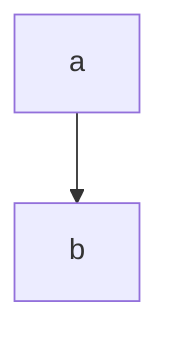

# Architecture diagrams

Diagrams live here; the reasoning behind them is in [`docs/architecture.md`](../docs/architecture.md).

| File | What it shows | Maintained |
| --- | --- | --- |
| [`dependency-graph.mmd`](dependency-graph.mmd) | Startup order, grouped by layer | **Generated** by `make docs` |
| [`overview.md`](overview.md) | System overview, networks, request path, ASCII diagrams | By hand |

The generated graph is regenerated from the compose project itself, so it cannot drift. CI fails if the
committed copy does not match what `make docs` produces.

## Rendering

Mermaid renders natively on GitHub inside a fenced block:

````markdown

````

To render `dependency-graph.mmd` locally:

```bash
npx -y @mermaid-js/mermaid-cli -i architecture/dependency-graph.mmd -o architecture/dependency-graph.svg
```

Or paste it into [mermaid.live](https://mermaid.live).
