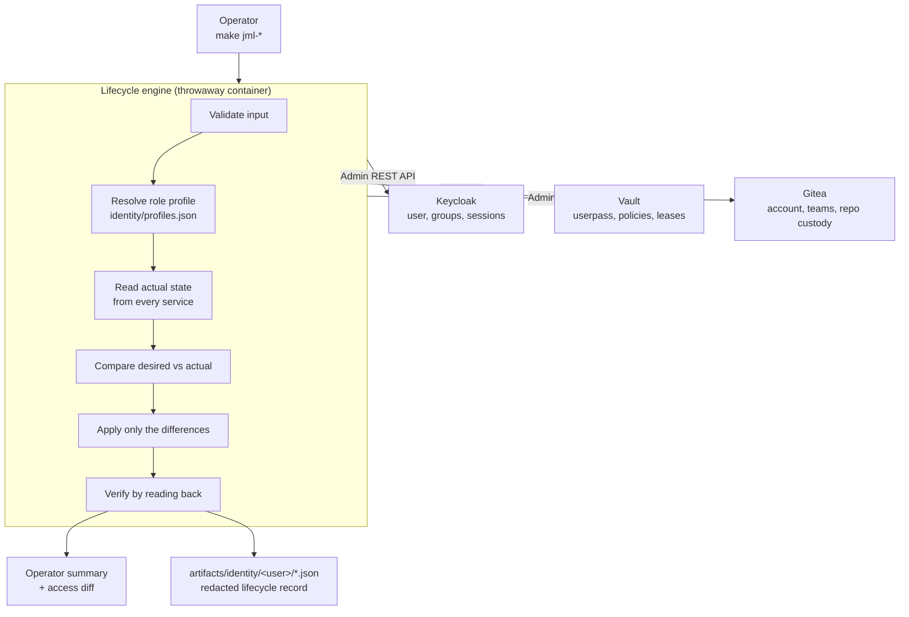
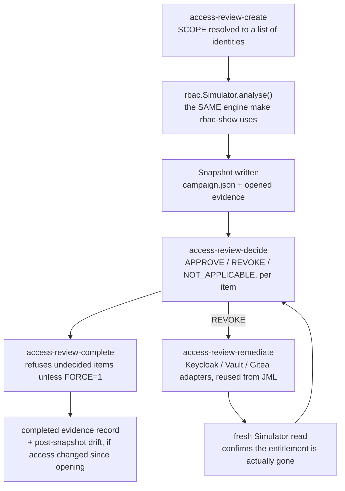

# Identity Governance

Joiner / Mover / Leaver lifecycle automation, an RBAC simulator, and access
review campaigns for the seeded Keycloak realm.

Roadmap items [`v2-1`, `v2-2` and `v2-3`](../roadmap/README.md). This page
documents what is implemented, how it works, and what it does not do.

---

## Overview

The v1 lab models role-based access control correctly: realm roles are granted to
groups, and users join groups. What a static realm cannot show is what happens
**over time**, which is where real identity programmes actually fail:

- Someone joins and gets access to four systems, provisioned by hand, inconsistently.
- Someone changes team and *accumulates* entitlements, because adding access is
  urgent and removing it never is.
- Someone leaves, their account is disabled, and their refresh token keeps
  working for another month.

JML makes each of those a single, idempotent, auditable command.

```bash
make jml-join  USER=erin ROLE=developer
make jml-move  USER=erin FROM=developer TO=security
make jml-leave USER=erin
make jml-show  USER=erin
```

---

## Architecture



The engine runs in a `python:3.12-alpine` container attached to the lab's edge
network, using only the Python standard library. Nothing is installed on the
host: no Python, no `jq`, no Keycloak, Vault or Gitea CLI. `docker compose up -d`
is unchanged.

### Why reconciliation

Every flow reads what each service currently reports, compares it with what the
role profile declares, and applies only the differences. That is what makes the
commands idempotent, and it is far closer to how real provisioning systems work
than firing `create` calls and hoping.

---

## Role profiles

A profile is the **desired state of an identity**, declared once in
[`identity/profiles.json`](../identity/profiles.json) and applied everywhere.

| Profile | Keycloak group | Effective realm roles | Vault policy | Gitea team |
| --- | --- | --- | --- | --- |
| `developer` | `/Application Engineering` | `developer`, `ai-user` | `developer` | `developers` (write) |
| `platform-admin` | `/Platform Engineering` | `platform-admin`, `developer`, `ai-user` | `platform-admin` | `platform` (admin) |
| `security` | `/Security` | `security-analyst`, `auditor`, `ai-user` | `security-analyst` | `security` (read) |
| `contractor` | `/Contractors` | `contractor` | `contractor` | `contractors` (read) |

Every group listed already exists in
[`configs/keycloak/realm-export.json`](../configs/keycloak/realm-export.json).
Profiles are a way to *reach* the seeded RBAC model, not a parallel one.

Two consequences worth stating explicitly:

- **Authorization stays group-based.** The engine never grants a realm role
  directly to a user. Groups carry the roles; users carry group membership. A
  direct role grant would be invisible to the group model and the first thing to
  be forgotten at offboarding.
- **`effective_roles` in the profile is documentation.** It renders the access
  diff and is asserted against, but it is never *written*. When the engine
  verifies, it reads the real composite role mapping back from Keycloak, so the
  diff stays honest even if someone edits the realm by hand.

The `contractor` Vault policy ([`configs/vault/policies/contractor.hcl`](../configs/vault/policies/contractor.hcl))
is new in v2-1; the other three shipped with v1.

---

## Joiner

```bash
make jml-join USER=erin ROLE=developer
```

1. Validate the username against a strict pattern and refuse seeded demo identities.
1. Resolve the role profile.
1. **Keycloak.** Create or reconcile the user, declare and set attributes
   (`title`, `department`, `costCenter`, `employeeId`, `lifecycleState`), set an
   initial credential *only if none exists*, and add the profile's group.
1. **Vault.** Create the `userpass` identity bound to exactly one policy,
   loading that policy from `configs/vault/policies/` if the running Vault does
   not have it yet.
1. **Gitea.** Ensure the organisation and team exist, create or reactivate the
   account, and add the team membership.
1. Verify by reading back: effective roles, Vault policy list, team membership.
1. Print a welcome summary and write a lifecycle record.

The initial credential is `DEMO_USER_PASSWORD`, the same shared lab password
the seeded users get, printed by `make creds`. A provisioned identity therefore
behaves exactly like `alice` or `bob`. It is never written to an artifact.

### Idempotency

Running it twice converges rather than duplicating. Statuses are explicit:

| Status | Meaning |
| --- | --- |
| `CREATED` | The object did not exist and was created |
| `UPDATED` | It existed but drifted from the profile, and was corrected |
| `UNCHANGED` | Already matched the desired state; nothing was done |
| `FAILED` | The operation could not be completed |

A second `jml-join` reports `UNCHANGED` throughout, and does not reset a password
the person may have already changed.

---

## Mover

```bash
make jml-move USER=erin FROM=developer TO=security
```

`FROM` and `TO` are **profile names**, not raw group names.

The order is the whole point:

1. Capture the before snapshot.
1. **Remove** the obsolete group membership.
1. **Then** add the new one.
1. Replace the Vault policy list (replace, never append).
1. Remove the old Gitea team, add the new one.
1. Revoke Keycloak sessions, so the person cannot keep using a token minted
   under their previous authorization.
1. Capture the after snapshot and render the diff.

Removing before adding means the identity never holds both entitlements, even
for the milliseconds between two API calls. **Entitlement accumulation is the
failure this flow exists to prevent**, and the test suite asserts specifically
that the old group, old roles, old Vault policy and old team are gone, not just
that the new ones arrived.

Example output:

```text
Access diff
───────────
  - gitea:team developers
  - keycloak:group /Application Engineering
  - keycloak:role developer
  - vault:policy developer
  + gitea:team security
  + keycloak:group /Security
  + keycloak:role auditor
  + keycloak:role security-analyst
  + vault:policy security-analyst
```

Those strings are resolved from live API reads, not from the profile.

---

## Leaver

```bash
make jml-leave USER=erin
```

The most important flow, and the one with the most nuance.

### Disable, do not delete

Both Keycloak and Gitea accounts are **retained and disabled**, never deleted:

- Deleting a Keycloak user destroys the audit trail that offboarding exists to produce.
- Deleting a Gitea user rewrites commit attribution, so history silently loses its author.

The Keycloak account is disabled with `lifecycleState=offboarded`; the Gitea
account is set `active: false` with `prohibit_login: true`. Both block every
login path while leaving history intact. There is **no delete call anywhere in
the Gitea adapter.**

### Session and token revocation

This is the half that gets missed. `POST /users/{id}/logout` does more than its
name suggests:

- ends all online sessions
- invalidates the refresh tokens bound to them
- bumps the user's `notBefore`, which is what makes already-issued tokens fail
  server-side validation

Offline sessions are enumerated per client and revoked separately, because a
plain logout does not always clear them, and an offline token surviving
offboarding is the failure mode this flow targets.

**What is genuinely proven, and what is not:**

Keycloak issues self-contained JWT access tokens. No identity provider can reach
into a resource server and un-issue one. After `jml-leave`:

| Validation model | Result |
| --- | --- |
| `userinfo` endpoint | Rejected **immediately** |
| Token introspection (RFC 7662) | Reports `active: false` **immediately** |
| Forward-auth proxy consulting Keycloak | Rejected **immediately** |
| Resource server validating the JWT signature offline, with no introspection | **Still accepts** until `exp` |

That last row is a property of stateless JWTs, not a defect in this
implementation, and it is bounded: the realm sets `accessTokenLifespan` to
**300 seconds**, so the worst-case window is five minutes. Refresh tokens, which
would otherwise grant indefinite access, are invalidated immediately.

The test suite proves the rows it can prove and does not claim the one it
cannot. See [Verification](#verification).

### Vault revocation

Order matters. Deleting the `userpass` entry stops new logins but does nothing
to a token already in circulation, and Vault tokens outlive the auth entry that
created them. So the engine deletes the identity **and then** calls
`sys/leases/revoke-prefix` on `auth/userpass/login/<user>` to sever live access.

### Gitea repository custody

Repositories personally owned by the departing user are **transferred** to the
custody account (`labadmin` by default, configurable via
`gitea.repository_transfer_target` in `profiles.json`).

- Transfer, never delete. A leaver's repositories are usually the most valuable
  thing they leave behind.
- Organisation-owned repositories need no transfer; only personally-owned ones
  are moved.
- If a transfer fails, most commonly because the custody account already owns a
  repository of that name, the service is reported `FAILED` and the overall
  result becomes `PARTIAL_FAILURE`. The engine will not quietly continue past an
  offboarding step that did not happen.

---

## RBAC simulator

Roadmap item `v2-2`. Answers the question an access review actually asks:
**what can this person reach, and why?**

```bash
make rbac-show    USER=erin
make rbac-show    USER=erin FORMAT=json
make rbac-diff    USER=alice OTHER=bob
make rbac-who-can PERMISSION=vault:secret/data/security/*
```

**Strictly read-only.** Every call the simulator makes is a `GET`. It never adds
a group, changes a policy, touches a team or disables an account, and the test
suite snapshots identity state before and after a full run to prove it. Drift is
reported, never corrected. Remediation is a deliberate act with an audit trail,
which is the `jml-*` commands' job.

### What it resolves, and how

It does not restate `profiles.json`. It resolves the chain from live state:

| Service | How access is determined | Confidence |
| --- | --- | --- |
| Keycloak | Groups and the **composite** realm role mapping, read from the API | Enforced |
| Vault | Attached policies, then the policy **document Vault is serving**, parsed into paths and capabilities | Enforced |
| Gitea | Organisation team membership and each team's permission level | Enforced |
| Grafana | Derived from realm roles via the deployment's `role_attribute_path`, and only when `GRAFANA_OIDC_ENABLED=true` | Derived |
| Prometheus, Traefik, Portainer, pgAdmin, Adminer, MinIO, Open WebUI | Not wired to Keycloak | `NOT_IDENTITY_INTEGRATED` |

Parsing the policy document Vault is *serving* rather than the `.hcl` in the
repository is deliberate: if someone edited a policy at runtime, a review must
show what is live, not what is committed.

Every grant carries a decision, a permission, a reason, and how it was
inherited: `direct`, `group-inherited`, or `derived`.

Five decisions, not two. `NOT_IDENTITY_INTEGRATED` and `UNKNOWN` are genuinely
different from `NOT_AUTHORIZED`, and collapsing them into "denied" is how access
reviews end up confidently wrong.

### Drift detection

Expected access comes from the role profile implied by the identity's current
group; actual access comes from the services. The difference is drift:

| Kind | Meaning |
| --- | --- |
| `EXTRA_KEYCLOAK_GROUP` | Member of more than one group, so no single profile describes them |
| `EXTRA_GITEA_TEAM` | In a team the profile does not grant |
| `UNEXPECTED_VAULT_POLICY` | Holds a policy the profile does not grant |
| `MISSING_VAULT_POLICY` / `MISSING_GITEA_TEAM` / `MISSING_REALM_ROLE` | The profile expects it; it is absent |
| `STALE_VAULT_POLICY` / `STALE_GITEA_TEAM` | Downstream access surviving an offboarding |
| `NO_GROUP` | Enabled but in no group, so inheriting nothing |

Running it against the seeded realm immediately found real drift: `alice`,
`bob`, `carol` and `dave` have no Gitea accounts, because v1's provisioning only
ever created `labadmin`. That is a true finding about this lab, not a synthetic
example.

### Offboarded identities

A disabled account is reported as disabled with its retained downstream accounts
listed, never as "user not found". An account that outlives its identity is
precisely what an access review exists to catch, so downstream services are
checked even when no Keycloak identity exists at all.

### `who-can` and wildcards

Resource matching runs in **both directions**. A user holding Vault `secret/*`
can reach `secret/data/security/foo`, so asking who can reach
`secret/data/security/` returns them even though the granted string is shorter
than the query. Prefix matching alone would answer "nobody", which is the most
dangerous wrong answer an access review can give.

### Relationship to the lifecycle commands

The simulator makes lifecycle changes legible:

```bash
make jml-join  USER=erin ROLE=developer && make rbac-show USER=erin
make jml-move  USER=erin FROM=developer TO=security && make rbac-show USER=erin
make jml-leave USER=erin && make rbac-show USER=erin
```

It also found a genuine sharp edge in v2-1 while walking all four profiles: the
joiner only ever *added* a group, so a second `jml-join` with a different role
left the identity holding both. The joiner now refuses and points at
`jml-move`, which removes the old access first and records a diff.

---

## Access review campaigns

Roadmap item `v2-3`. A campaign answers the question the simulator alone
cannot: who currently has access to what, who reviewed it, what decision was
made, and what evidence proves the review happened.

```bash
make access-review-create   NAME=quarterly-q3 [SCOPE=all|profile:developer|user:erin]
make access-review-show     CAMPAIGN=<id> [FORMAT=json]
make access-review-list
make access-review-decide   CAMPAIGN=<id> USER=erin ENTITLEMENT="Service:resource" DECISION=approve
make access-review-complete CAMPAIGN=<id>
make access-review-remediate CAMPAIGN=<id>
make access-review-cancel   CAMPAIGN=<id>
```

### Architecture



The campaign engine does not discover access on its own. Every entitlement it
reviews comes from `rbac.Simulator`, the same engine behind `rbac-show`. A
campaign is a workflow layered on top of that engine, not a second
authorization model. Remediation reuses the exact `keycloak.py` /
`vault.py` / `gitea.py` adapter methods the JML commands use. There is no
second implementation of "remove a group" or "drop a policy" here.

### Role profiles feed the review

A campaign is only useful if it can say *why* an entitlement is or is not
expected. That comes directly from the role profile system v2-1 already
established: `rbac.Simulator.classify_expectation()` compares each held grant
against the profile implied by the identity's current group and marks it
`EXPECTED`, `UNEXPECTED`, `NOT_MODELED` (account sign-in, personally-owned
Gitea repositories, the Grafana role: nothing `profiles.json` has an opinion
about), or `NO_PROFILE` (an identity in more than one group, or none, does not
resolve to a single profile to compare against).

### Lifecycle

`draft -> open -> completed`, with `cancelled` reachable from either of the
first two. `access-review-create` moves straight from draft to open in one
step: nothing in this feature needs a scope to sit undecided before its
snapshot is captured, so there is no separate "open" command.

| State | Meaning |
| --- | --- |
| `draft` | Scope defined, snapshot not yet taken (internal only; no command stops here) |
| `open` | Snapshot captured, items can be decided |
| `completed` | Closed. Idempotent: completing an already-completed campaign is a no-op, not an error |
| `cancelled` | Closed without review. Idempotent the same way; cannot later be completed |

### Snapshot immutability

The entitlements a campaign reviews are captured once, at creation, and never
re-fetched to answer "what does this item currently show." Re-running
`access-review-show` on the same campaign returns the same item list even if
live access has changed since. A **new** campaign created after that change
does see it. The snapshot is a point-in-time record, not a live view.

If access genuinely changes after a campaign opens, that is not hidden: at
`access-review-complete`, every identity in scope is re-analysed and the
difference against the original snapshot is recorded as `post_snapshot_drift`
(gained / lost, per identity), alongside the untouched original items.

### Decisions

Every item starts `UNDECIDED`, an explicit value written into the record, not
an absence of one, so an item nobody has looked at cannot be mistaken for one
that was approved. Three decisions:

| Decision | Meaning | Remediation |
| --- | --- | --- |
| `APPROVE` | Access confirmed correct | `NOT_REQUIRED` |
| `REVOKE` | Access should be removed | `PENDING`, until `access-review-remediate` runs |
| `NOT_APPLICABLE` | Reviewed, no action needed | `NOT_REQUIRED` |

A second decision on the same item is refused unless `FORCE=1` is passed, and
the refusal names the existing decision, its timestamp and who made it.
`access-review-complete` refuses to close a campaign with undecided items
unless `FORCE=1`, and forcing does **not** mark them approved; they stay
recorded as `UNDECIDED` in the completed record, with a note that items were
left undecided.

### Remediation is not the same act as deciding

Recording `REVOKE` is a governance decision. It changes nothing live. It only
sets the item's remediation status to `PENDING`. Nothing about Keycloak, Vault
or Gitea changes until `access-review-remediate` runs, and that command is the
**only** campaign command that mutates anything.

The rule that keeps remediation safe: every action mutates an **attachment**
(a group membership, a policy binding, a team membership), never a **shared
definition** (a Vault policy document, a Keycloak group itself). A policy or a
group can be relied on by other identities; the attachment between one person
and one of those objects cannot be.

| Item type | Remediation |
| --- | --- |
| Keycloak group membership | `keycloak.remove_group` |
| Keycloak role, directly assigned (not via a group) | `keycloak.remove_direct_realm_role` |
| Keycloak role, granted by a group | `MANUAL_ACTION_REQUIRED`. Revoke the group item instead; stripping the role directly would silently no-op, since the endpoint only touches direct assignments |
| Vault policy attachment | `vault.set_policies`, computed as *current policies minus the one revoked*, never a blind replace |
| Vault path inside a policy | `MANUAL_ACTION_REQUIRED`. The path is not removable on its own without rewriting a policy document other identities may share |
| Gitea team membership | `gitea.remove_team_membership` |
| Gitea repository ownership | `MANUAL_ACTION_REQUIRED`. Points at `jml-leave`, which transfers rather than orphans |
| Anything else (Grafana, account sign-in) | `MANUAL_ACTION_REQUIRED` |

Every remediation attempt is verified against a **fresh** `Simulator.analyse()`
call afterward, never trusted from the adapter's own report of success. This
is what catches an entitlement surviving through a different inheritance path:
if the same grant key is still present, the fresh read shows its new source,
and that source is what explains the failure instead of a bare "still
present." An already-absent entitlement (removed some other way, or the
identity offboarded entirely before remediation ran) resolves to `VERIFIED`
with "already absent" rather than an error. The removal calls are the same
idempotent adapter methods JML already relies on.

Remediation is safe to re-run: an item already `VERIFIED`, `NOT_REQUIRED` or
`MANUAL_ACTION_REQUIRED` is skipped; only `PENDING` or `FAILED` items are
attempted again.

### Protected identities

`access-review-remediate` refuses to mutate a seeded demo identity
(`alice`, `bob`, `carol`, `dave`, `admin`, `labadmin`) unless
`LAB_ALLOW_PROTECTED=1` is set, the same escape hatch the JML commands already
use. A campaign may still **review** a protected identity: reading access and
recording a decision never mutates anything. The guard applies only at the
point something would actually change.

### Scope

Three forms, deliberately not a query language:

| Scope | Resolves to |
| --- | --- |
| `all` (default) | Every identity in the realm |
| `profile:<name>` | Everyone currently in that role profile's Keycloak group |
| `user:<name>` | Exactly one identity |

"One system" scoping (review only Vault entitlements, say) was considered and
left out: every item already carries its own `service` field, so filtering by
system is a one-line `jq`/`FORMAT=json` operation on the output rather than a
second dimension the campaign model needs to understand.

### Evidence

Every campaign writes to `artifacts/access-review/<id>/`:

```text
artifacts/access-review/quarterly-q3-20260820T191744Z/
  campaign.json                     the live working document
  20260820T191744Z-opened.json      immutable: the snapshot as captured
  20260820T192333Z-remediated.json  immutable: what remediation attempted and verified
  20260820T192333Z-001-remediated.json  a second same-type event in that second
  20260820T192333Z-completed.json   immutable: the final decision record
```

`campaign.json` is the live document, atomically replaced by every decide /
complete / remediate call. The timestamped files beside it are opened in
exclusive-create mode and never rewritten. If an event name and timestamp
collide, the later file receives `-001`, `-002` and so on. That makes "what did
this review actually decide" answerable months later even if `campaign.json`
has since changed (it does not, once a campaign is completed, but the
distinction matters while one is still open). Both pass through the same
redaction chokepoint `record.py` uses; the test suite asserts directly that no
credential from the environment appears in either.

### A real demo, not a synthetic one

```bash
make jml-join USER=erin ROLE=developer
```

Adding erin to the `security` Gitea team directly (bypassing JML, the way a
real misconfiguration or manual fix would) creates genuine drift:

```bash
make access-review-create NAME=quarterly-q3 SCOPE=user:erin
```

```text
UNDECIDED      Gitea:team security [read]
    why: team membership in lab-engineering  (direct)
    expectation: UNEXPECTED

Drift (context, not a decidable item):
  EXTRA_GITEA_TEAM: Member of Gitea team 'security', which profile 'developer' does not grant
```

Approving the thirteen legitimate entitlements and revoking the one
unexpected team, then remediating:

```bash
make access-review-remediate CAMPAIGN=quarterly-q3-<timestamp>
```

```text
erin  Gitea:team security  VERIFIED
    removed from team 'security'
```

`make access-review-complete` then closes the campaign: 13 `APPROVE`, 1
`REVOKE`, remediation `VERIFIED`. Re-running `access-review-show` on that
campaign continues to show the same 14 items and the same decisions;
`rbac-show USER=erin` independently confirms the security team is gone and
the developer team is not.

### The seeded-user drift is context, not a fabricated item

v2-2 found real drift on the seeded realm: `alice`, `bob`, `carol` and `dave`
have no Gitea account, because v1 provisioning only ever created `labadmin`.
That drift is a **missing** entitlement, not a held one, so it cannot become a
review item. Items are built from grants an identity actually has. A
campaign reviewing these users still surfaces it, in `drift_context`, exactly
as `rbac-show` would report it; it is simply not something `access-review-decide`
can act on. Provisioning the missing account is `jml-join`'s job, not a
revoke decision's.

---

## Verification

Each flow verifies by **reading state back from the API**, not by assuming its
writes worked:

| Flow | Verified |
| --- | --- |
| Joiner | effective roles include the profile's roles; Vault holds exactly one policy; Gitea team membership present |
| Mover | obsolete roles absent; new roles present; Vault policy list replaced; old team gone, new team present |
| Leaver | password grant refused; zero active sessions; Vault login refused; Gitea login refused; no team memberships; repository present under the custody account |

`make jml-test` runs **387 checks** across three suites: 105 lifecycle, 133 RBAC
simulator, 149 access review campaign, against the **running lab**. Run one at
a time with `make jml-test SUITE=lifecycle|rbac|access-review`. Authorization
and remediation results are verified against the real services. One controlled
adapter failure is injected to prove a failed entitlement does not stop later
items and is never reported as revoked. Disposable identities only (`jmltest`,
`jmltoken`, `campaigntest`, `campaigntest2`, `campaigne2e`); the seeded demo
users are protected by an explicit deny-list and are never modified.

---

## Failure handling

There are **no transactions across Keycloak, Vault and Gitea**, and the tool does
not pretend otherwise. Each service reports its own outcome:

```text
Result
──────
  Keycloak     UPDATED
  Vault        UPDATED
  Gitea        FAILED

  Overall      PARTIAL_FAILURE
```

The compensating behaviour is reconciliation: **fix the underlying problem and
re-run the same command.** Because every flow applies only differences, the
re-run completes exactly the parts still outstanding and leaves the rest alone.

Before making any change, all three services are health-checked. A leaver that
disabled Keycloak but never reached Vault is worse than one that refused to
start, because the operator believes it finished.

Access-review remediation handles failure per entitlement. A failed adapter
call is retained as `FAILED`, later items still run, and only a fresh RBAC read
can produce `VERIFIED`. Fix the failed service and rerun remediation; verified
items are left alone while failed items are retried. Commands that only use the
stored snapshot (`list`, `show`, `decide`, `cancel`) remain available during a
downstream outage and run their engine container with networking disabled.
`create`, `complete` and `remediate` require live services.

Persisted campaign data is schema-validated before use. Malformed JSON,
inconsistent item identifiers, unknown lifecycle values and invalid remediation
states fail with a controlled validation error. `list` skips a damaged campaign
so the remaining records stay usable; it never treats damaged state as success.

---

## Audit records

Every command writes a JSON record to `artifacts/identity/<user>/`:

```text
artifacts/identity/erin/
  20260819T012802Z-join.json
  20260819T012822Z-move.json
  20260819T013043Z-leave.json
```

Each contains the operation, user, timestamp, services evaluated, per-service
changes and verification results, before/after access snapshots, and the
entitlements added and removed.

**Secrets never reach these files.** Every payload passes through a single
redactor that recursively strips any key matching `password`, `secret`, `token`,
`credential`, `cookie`, `private_key` or `client_secret`. The test suite asserts
both that the redactor works and that no live credential from `.env` appears in
any artifact on disk.

`artifacts/` is git-ignored.

---

## Security notes

- **Least privilege in the profiles.** `contractor` gets read on one secret path
  and explicit `deny` everywhere else. `deny` beats every other rule in Vault, so
  it survives a future broadening of the grants above it.
- **Admin credentials stay in the environment.** They are passed to the container
  as environment variables, never as command-line arguments. Argv is visible to
  every process on the host; an environment block is not. They are used only to
  authenticate the adapters and are never logged or persisted.
- **Injection resistance.** The engine builds no shell commands from user input;
  everything is an HTTP call with the value in a path segment or JSON field. On
  top of that, usernames must match `^[a-z][a-z0-9._-]{1,30}$`, which excludes
  path traversal, URL escapes, shell metacharacters and whitespace by
  construction. The test suite fires ten hostile usernames at it.
- **No direct database access.** Everything goes through supported APIs, so the
  realm cache, event log and admin console stay consistent.
- **Seeded identities are protected.** `alice`, `bob`, `carol`, `dave`, `admin`
  and `labadmin` are refused by every mutating command.

---

## Limitations

What v2-1, v2-2 and v2-3 deliberately do **not** do:

- **No authoritative identity source.** The operator's command *is* the request.
  There is no HR system, no Workday or SCIM feed, no joiner queue.
- **No approval workflow for provisioning.** Anyone who can run `make` can
  provision or offboard. There is no request, no approver, no segregation of
  duties for the JML commands themselves. A campaign reviews access after the
  fact, it does not gate access before it is granted.
- **No offline-JWT revocation.** As described above, bounded by a 300-second
  token lifespan.
- **No email.** The "welcome summary" prints to the terminal. The lab has no
  mail server, and accounts are created with `must_change_password: false`
  because a forced reset would strand the account behind a prompt nobody can clear.
- **Shared demo credential.** Joiners receive `DEMO_USER_PASSWORD`, not a unique
  generated secret, so provisioned identities behave like the seeded ones. This
  is a lab convenience and would be wrong in production.
- **No privileged access management.** No just-in-time elevation, no session
  recording, no break-glass.
- **Not highly available.** Vault runs in dev mode with in-memory storage; its
  state does not survive a container restart. The engine reconciles policies
  back on demand, but tokens and leases do not persist.
- **Personal repositories only.** Repository custody transfer covers repositories
  the user personally owns. Organisation-owned repositories are untouched by
  design.

Specific to the RBAC simulator:

- **No remediation.** Drift is reported and never corrected. That is a design
  decision, not a gap.
- **Expected state needs exactly one group.** An identity in two groups matches
  no single profile, so drift detection reports the extra membership and then
  stops short of deriving expected downstream access.
- **Grafana is derived, not observed.** The Grafana role is computed from the
  `role_attribute_path` expression in the compose file, not read from Grafana's
  own database. If that expression changes, `GRAFANA_ROLE_RULES` in `rbac.py`
  must change with it. Nothing enforces that today.
- **Vault path matching is prefix-and-wildcard, not a policy engine.** It does
  not evaluate Vault's full precedence rules, templated paths, or parameter
  constraints. For the lab's policies it is accurate; for arbitrary ones it is
  an approximation.
- **`who-can` scans the realm's users.** It is capped at 200 identities and
  reports the first matching grant per user rather than the most specific one.
- **Unintegrated services are a maintained list.** `UNINTEGRATED_SERVICES` in
  `rbac.py` is hand-written. A newly added service will not appear in the report
  until it is listed there.

Specific to access review campaigns:

- **No scheduling or recurrence.** A campaign is created on demand. There is
  no "quarterly, automatically" mechanism; running one on a cadence is an
  operator or cron responsibility outside this feature.
- **No notification.** Nobody is emailed that a campaign exists or that an
  item is waiting on them. The lab has no mail server, the same constraint
  the joiner's "welcome summary" already lives with.
- **Remediation is limited to what the JML adapters already support.** A role
  granted by a group, a single Vault path inside a policy, and repository
  ownership all resolve to `MANUAL_ACTION_REQUIRED` rather than an automated
  fix, deliberately, since none of those can be safely narrowed to "this one
  attachment" without risking a shared object or a colleague's access. See
  the remediation table above.
- **`FORCE=1` on `access-review-complete` closes a campaign with items still
  `UNDECIDED`.** It never marks them approved, but a completed campaign with
  undecided items is a real gap in the review, not merely a formality. Reading
  the `notes` field on a completed campaign is how that gap is surfaced.
- **No cross-campaign history.** Each campaign is an independent, self-contained
  record. There is no view of "how has alice's access changed across the last
  four campaigns"; that comparison would need to be built from the individual
  evidence records by hand.

The remaining v2 roadmap items (a SCIM endpoint, identity audit pipelines,
alerting and forward-auth) are **not implemented**. See
[the roadmap](../roadmap/README.md).

---

## Reference

| Path | Purpose |
| --- | --- |
| `identity/profiles.json` | Declarative role profiles |
| `scripts/identity/jml.py` | Flow orchestration and operator output |
| `scripts/identity/keycloak.py` | Keycloak Admin API adapter |
| `scripts/identity/vault.py` | Vault userpass and policy adapter |
| `scripts/identity/gitea.py` | Gitea account, team and custody adapter |
| `scripts/identity/model.py` | Profiles, validation, change tracking |
| `scripts/identity/record.py` | Audit records and secret redaction |
| `scripts/identity/labhttp.py` | Standard-library HTTP helper |
| `scripts/identity/rbac.py` | RBAC analysis: effective access, drift and expectation classification (read-only) |
| `scripts/identity/rbac_cli.py` | Simulator CLI, rendering, diff and who-can |
| `scripts/identity/campaign.py` | Access review workflow: snapshot, decide, complete, remediate |
| `scripts/identity/campaign_cli.py` | Campaign CLI and rendering |
| `scripts/identity/test_lifecycle.py` | Lifecycle integration test suite |
| `scripts/identity/test_rbac.py` | Simulator integration test suite |
| `scripts/identity/test_campaign.py` | Access review integration test suite |
| `scripts/jml.sh` | Lifecycle entry point |
| `scripts/rbac.sh` | Simulator entry point |
| `scripts/access-review.sh` | Access review campaign entry point |
| `scripts/lib/engine.sh` | Shared containerised runner for all of the above |
| `scripts/test-identity.sh` | Containerised test entry point |
| `configs/vault/policies/contractor.hcl` | Vault policy added for the contractor profile |
