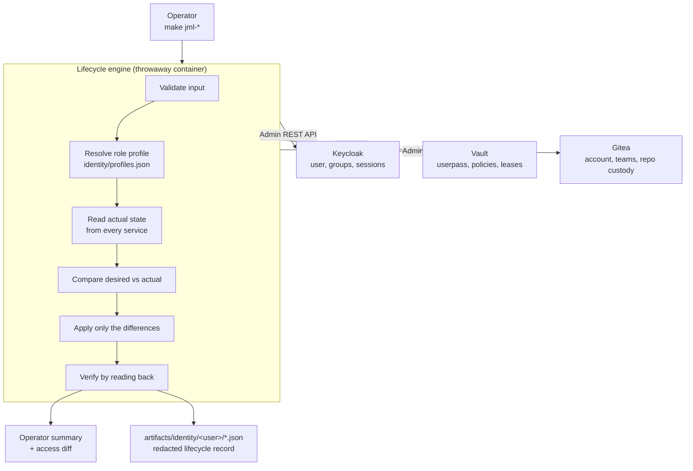

# Identity Governance

Joiner / Mover / Leaver lifecycle automation for the seeded Keycloak realm.

Roadmap item [`v2-1`](../roadmap/README.md). This page documents what is
implemented, how it works, and — at least as importantly — what it does not do.

---

## Overview

The v1 lab models role-based access control correctly: realm roles are granted to
groups, and users join groups. What a static realm cannot show is what happens
**over time**, which is where real identity programmes actually fail:

- Someone joins and gets access to four systems, provisioned by hand, inconsistently.
- Someone changes team and *accumulates* entitlements, because adding access is
  urgent and removing it never is.
- Someone leaves, their account is disabled, and their refresh token keeps
  working for another month.

JML makes each of those a single, idempotent, auditable command.

```bash
make jml-join  USER=erin ROLE=developer
make jml-move  USER=erin FROM=developer TO=security
make jml-leave USER=erin
make jml-show  USER=erin
```

---

## Architecture



The engine runs in a `python:3.12-alpine` container attached to the lab's edge
network, using only the Python standard library. Nothing is installed on the
host — no Python, no `jq`, no Keycloak, Vault or Gitea CLI. `docker compose up -d`
is unchanged.

### Why reconciliation

Every flow reads what each service currently reports, compares it with what the
role profile declares, and applies only the differences. That is what makes the
commands idempotent, and it is far closer to how real provisioning systems work
than firing `create` calls and hoping.

---

## Role profiles

A profile is the **desired state of an identity**, declared once in
[`identity/profiles.json`](../identity/profiles.json) and applied everywhere.

| Profile | Keycloak group | Effective realm roles | Vault policy | Gitea team |
|---|---|---|---|---|
| `developer` | `/Application Engineering` | `developer`, `ai-user` | `developer` | `developers` (write) |
| `platform-admin` | `/Platform Engineering` | `platform-admin`, `developer`, `ai-user` | `platform-admin` | `platform` (admin) |
| `security` | `/Security` | `security-analyst`, `auditor`, `ai-user` | `security-analyst` | `security` (read) |
| `contractor` | `/Contractors` | `contractor` | `contractor` | `contractors` (read) |

Every group listed already exists in
[`configs/keycloak/realm-export.json`](../configs/keycloak/realm-export.json).
Profiles are a way to *reach* the seeded RBAC model, not a parallel one.

Two consequences worth stating explicitly:

- **Authorization stays group-based.** The engine never grants a realm role
  directly to a user. Groups carry the roles; users carry group membership. A
  direct role grant would be invisible to the group model and the first thing to
  be forgotten at offboarding.
- **`effective_roles` in the profile is documentation.** It renders the access
  diff and is asserted against, but it is never *written*. When the engine
  verifies, it reads the real composite role mapping back from Keycloak, so the
  diff stays honest even if someone edits the realm by hand.

The `contractor` Vault policy ([`configs/vault/policies/contractor.hcl`](../configs/vault/policies/contractor.hcl))
is new in v2-1; the other three shipped with v1.

---

## Joiner

```bash
make jml-join USER=erin ROLE=developer
```

1. Validate the username against a strict pattern and refuse seeded demo identities.
1. Resolve the role profile.
1. **Keycloak** — create or reconcile the user, declare and set attributes
   (`title`, `department`, `costCenter`, `employeeId`, `lifecycleState`), set an
   initial credential *only if none exists*, and add the profile's group.
1. **Vault** — create the `userpass` identity bound to exactly one policy,
   loading that policy from `configs/vault/policies/` if the running Vault does
   not have it yet.
1. **Gitea** — ensure the organisation and team exist, create or reactivate the
   account, and add the team membership.
1. Verify by reading back: effective roles, Vault policy list, team membership.
1. Print a welcome summary and write a lifecycle record.

The initial credential is `DEMO_USER_PASSWORD` — the same shared lab password
the seeded users get, printed by `make creds`. A provisioned identity therefore
behaves exactly like `alice` or `bob`. It is never written to an artifact.

### Idempotency

Running it twice converges rather than duplicating. Statuses are explicit:

| Status | Meaning |
|---|---|
| `CREATED` | The object did not exist and was created |
| `UPDATED` | It existed but drifted from the profile, and was corrected |
| `UNCHANGED` | Already matched the desired state; nothing was done |
| `FAILED` | The operation could not be completed |

A second `jml-join` reports `UNCHANGED` throughout and — importantly — does
**not** reset a password the person may have already changed.

---

## Mover

```bash
make jml-move USER=erin FROM=developer TO=security
```

`FROM` and `TO` are **profile names**, not raw group names.

The order is the whole point:

1. Capture the before snapshot.
1. **Remove** the obsolete group membership.
1. **Then** add the new one.
1. Replace the Vault policy list (replace, never append).
1. Remove the old Gitea team, add the new one.
1. Revoke Keycloak sessions, so the person cannot keep using a token minted
   under their previous authorization.
1. Capture the after snapshot and render the diff.

Removing before adding means the identity never holds both entitlements, even
for the milliseconds between two API calls. **Entitlement accumulation is the
failure this flow exists to prevent**, and the test suite asserts specifically
that the old group, old roles, old Vault policy and old team are gone — not
merely that the new ones arrived.

Example output:

```text
Access diff
───────────
  - gitea:team developers
  - keycloak:group /Application Engineering
  - keycloak:role developer
  - vault:policy developer
  + gitea:team security
  + keycloak:group /Security
  + keycloak:role auditor
  + keycloak:role security-analyst
  + vault:policy security-analyst
```

Those strings are resolved from live API reads, not from the profile.

---

## Leaver

```bash
make jml-leave USER=erin
```

The most important flow, and the one with the most nuance.

### Disable, do not delete

Both Keycloak and Gitea accounts are **retained and disabled**, never deleted:

- Deleting a Keycloak user destroys the audit trail that offboarding exists to produce.
- Deleting a Gitea user rewrites commit attribution, so history silently loses its author.

The Keycloak account is disabled with `lifecycleState=offboarded`; the Gitea
account is set `active: false` with `prohibit_login: true`. Both block every
login path while leaving history intact. There is **no delete call anywhere in
the Gitea adapter.**

### Session and token revocation

This is the half that gets missed. `POST /users/{id}/logout` does more than its
name suggests:

- ends all online sessions
- invalidates the refresh tokens bound to them
- bumps the user's `notBefore`, which is what makes already-issued tokens fail
  server-side validation

Offline sessions are enumerated per client and revoked separately, because a
plain logout does not always clear them — an offline token surviving offboarding
is exactly the failure mode this flow targets.

**What is genuinely proven, and what is not:**

Keycloak issues self-contained JWT access tokens. No identity provider can reach
into a resource server and un-issue one. After `jml-leave`:

| Validation model | Result |
|---|---|
| `userinfo` endpoint | Rejected **immediately** |
| Token introspection (RFC 7662) | Reports `active: false` **immediately** |
| Forward-auth proxy consulting Keycloak | Rejected **immediately** |
| Resource server validating the JWT signature offline, with no introspection | **Still accepts** until `exp` |

That last row is a property of stateless JWTs, not a defect in this
implementation, and it is bounded: the realm sets `accessTokenLifespan` to
**300 seconds**, so the worst-case window is five minutes. Refresh tokens — the
ones that would otherwise grant indefinite access — are dead immediately.

The test suite proves the rows it can prove and does not claim the one it
cannot. See [Verification](#verification).

### Vault revocation

Order matters. Deleting the `userpass` entry stops new logins but does nothing
to a token already in circulation, and Vault tokens outlive the auth entry that
created them. So the engine deletes the identity **and then** calls
`sys/leases/revoke-prefix` on `auth/userpass/login/<user>` to sever live access.

### Gitea repository custody

Repositories personally owned by the departing user are **transferred** to the
custody account (`labadmin` by default, configurable via
`gitea.repository_transfer_target` in `profiles.json`).

- Transfer, never delete. A leaver's repositories are usually the most valuable
  thing they leave behind.
- Organisation-owned repositories need no transfer; only personally-owned ones
  are moved.
- If a transfer fails — most commonly because the custody account already owns a
  repository of that name — the service is reported `FAILED` and the overall
  result becomes `PARTIAL_FAILURE`. The engine will not quietly continue past an
  offboarding step that did not happen.

---

## Verification

Each flow verifies by **reading state back from the API**, not by assuming its
writes worked:

| Flow | Verified |
|---|---|
| Joiner | effective roles include the profile's roles; Vault holds exactly one policy; Gitea team membership present |
| Mover | obsolete roles absent; new roles present; Vault policy list replaced; old team gone, new team present |
| Leaver | password grant refused; zero active sessions; Vault login refused; Gitea login refused; no team memberships; repository present under the custody account |

`make jml-test` runs 101 checks against the **running lab**. Nothing is mocked —
the feature being verified is whether revocation actually revokes, which a mock
cannot answer. It uses disposable identities (`jmltest`, `jmltoken`); the seeded
demo users are protected by an explicit deny-list and are never modified.

---

## Failure handling

There are **no transactions across Keycloak, Vault and Gitea**, and the tool does
not pretend otherwise. Each service reports its own outcome:

```text
Result
──────
  Keycloak     UPDATED
  Vault        UPDATED
  Gitea        FAILED

  Overall      PARTIAL_FAILURE
```

The compensating behaviour is reconciliation: **fix the underlying problem and
re-run the same command.** Because every flow applies only differences, the
re-run completes exactly the parts still outstanding and leaves the rest alone.

Before making any change, all three services are health-checked. A leaver that
disabled Keycloak but never reached Vault is worse than one that refused to
start, because the operator believes it finished.

---

## Audit records

Every command writes a JSON record to `artifacts/identity/<user>/`:

```text
artifacts/identity/erin/
  20260819T012802Z-join.json
  20260819T012822Z-move.json
  20260819T013043Z-leave.json
```

Each contains the operation, user, timestamp, services evaluated, per-service
changes and verification results, before/after access snapshots, and the
entitlements added and removed.

**Secrets never reach these files.** Every payload passes through a single
redactor that recursively strips any key matching `password`, `secret`, `token`,
`credential`, `cookie`, `private_key` or `client_secret`. The test suite asserts
both that the redactor works and that no live credential from `.env` appears in
any artifact on disk.

`artifacts/` is git-ignored.

---

## Security notes

- **Least privilege in the profiles.** `contractor` gets read on one secret path
  and explicit `deny` everywhere else. `deny` beats every other rule in Vault, so
  it survives a future broadening of the grants above it.
- **Admin credentials stay in the environment.** They are passed to the container
  as environment variables, never as command-line arguments — argv is visible to
  every process on the host; an environment block is not. They are used only to
  authenticate the adapters and are never logged or persisted.
- **Injection resistance.** The engine builds no shell commands from user input;
  everything is an HTTP call with the value in a path segment or JSON field. On
  top of that, usernames must match `^[a-z][a-z0-9._-]{1,30}$`, which excludes
  path traversal, URL escapes, shell metacharacters and whitespace by
  construction. The test suite fires ten hostile usernames at it.
- **No direct database access.** Everything goes through supported APIs, so the
  realm cache, event log and admin console stay consistent.
- **Seeded identities are protected.** `alice`, `bob`, `carol`, `dave`, `admin`
  and `labadmin` are refused by every mutating command.

---

## Limitations

What v2-1 deliberately does **not** do:

- **No authoritative identity source.** The operator's command *is* the request.
  There is no HR system, no Workday or SCIM feed, no joiner queue.
- **No approval workflow.** Anyone who can run `make` can provision or offboard.
  There is no request, no approver, no segregation of duties.
- **No access certification or review campaigns.** Nothing periodically asks
  whether existing access is still warranted.
- **No offline-JWT revocation.** As described above, bounded by a 300-second
  token lifespan.
- **No email.** The "welcome summary" prints to the terminal. The lab has no
  mail server, and accounts are created with `must_change_password: false`
  because a forced reset would strand the account behind a prompt nobody can clear.
- **Shared demo credential.** Joiners receive `DEMO_USER_PASSWORD`, not a unique
  generated secret, so provisioned identities behave like the seeded ones. This
  is a lab convenience and would be wrong in production.
- **No privileged access management.** No just-in-time elevation, no session
  recording, no break-glass.
- **Not highly available.** Vault runs in dev mode with in-memory storage; its
  state does not survive a container restart. The engine reconciles policies
  back on demand, but tokens and leases do not persist.
- **Personal repositories only.** Repository custody transfer covers repositories
  the user personally owns. Organisation-owned repositories are untouched by
  design.

The remaining v2 roadmap items — RBAC simulator, access review campaigns, a SCIM
endpoint, identity audit pipelines, alerting and forward-auth — are **not
implemented**. See [the roadmap](../roadmap/README.md).

---

## Reference

| Path | Purpose |
|---|---|
| `identity/profiles.json` | Declarative role profiles |
| `scripts/identity/jml.py` | Flow orchestration and operator output |
| `scripts/identity/keycloak.py` | Keycloak Admin API adapter |
| `scripts/identity/vault.py` | Vault userpass and policy adapter |
| `scripts/identity/gitea.py` | Gitea account, team and custody adapter |
| `scripts/identity/model.py` | Profiles, validation, change tracking |
| `scripts/identity/record.py` | Audit records and secret redaction |
| `scripts/identity/labhttp.py` | Standard-library HTTP helper |
| `scripts/identity/test_lifecycle.py` | Integration test suite |
| `scripts/jml.sh` | Containerised entry point |
| `scripts/test-identity.sh` | Containerised test entry point |
| `configs/vault/policies/contractor.hcl` | Vault policy added for the contractor profile |
